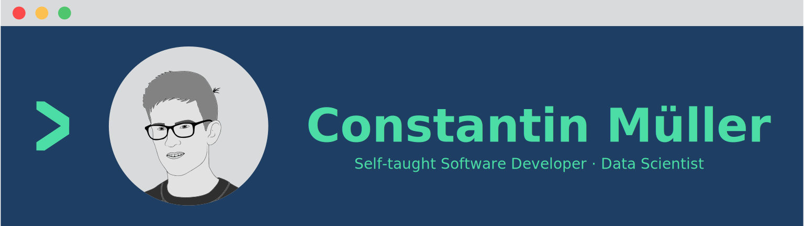

<h1 align="center">Hi 👋, I'm Constantin Müller</h1>

Who am I? I'm a developer and data analyst from Germany, who is interested in computer and data science. For me, programming isn't just a hobby but rather a passion. Hence, I'm a self-taught software developer and data scientist. Any further questions? Feel free to ask!

## Skills
These are some of the programming languages I know, frameworks and programming libraries that I know and use. I have taught myself many of the tools listed below over time. I also learned some programming languages and libraries during my academic career.

## Tools
These are tools that I use during development and infrastructure that I use for deployment.

